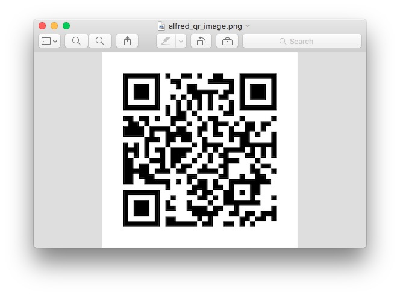

Alfred.QRCode
======================

A QRcode generator based on [python-qrcode](https://github.com/lincolnloop/python-qrcode) for Alfred Workflows.

##Install Python library:
1. Install image library [pillow](https://pypi.python.org/pypi/Pillow) by : `sudo pip install pillow`
2. Install [python-qrcode](https://github.com/lincolnloop/python-qrcode) by : `sudo easy_install qrcode`

##Usage:
1. Type `qr text`;
2. Define a hotkey, select some text, press the hotkey;

##Output:
1. The QRCode image your generate will be open with Preview application.

2. You can find the recently QRCode image path by this command in ternimal:
```
echo $TMPDIR'alfred_qr_image.png'
```

